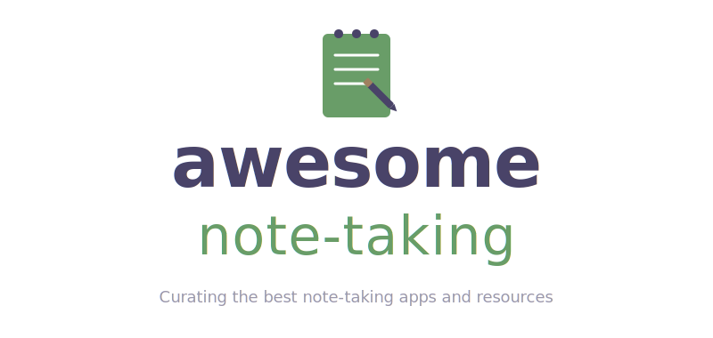

  
    
  
<strong>The most comprehensive, community-curated collection of note-taking tools.</strong> 
  Open source &amp; proprietary — organized, rated, and actively maintained.

   
  
  
  
  
  
    

> **What is this?** A hand-picked directory of 100+ note-taking apps, PKM tools,
> and knowledge management software — from simple markdown editors to full
> knowledge graphs. Whether you're a developer, student, writer, or researcher,
> you'll find the right tool here.
>
> *Know a great tool that's missing?*
> [Open a PR](contributing.md) — contributions are very welcome!

## Legend

| Icon | Meaning |
|:----:|:--------|
| 📖 | Notes stored in **plain text** (Markdown, org-mode, wiki, etc.) |
| 📕 | Notes stored in a **database** or proprietary format |
| 🤖 | **Android** support or app (see also [Termux](https://termux.dev/) for CLI tools) |
| 🍎 | **iOS** support or app |
| 👍 | **Recommended** — in active use for years by a PR author |
| 🔁 | Built-in **multi-device sync** (alternatively: [Syncthing](https://syncthing.net/) or any cloud provider) |
| 🔒 | **End-to-end encryption** support |
| ⚠️ | **Archived / abandoned** — kept for reference but no longer maintained |

## Contents

- [Open Source](#open-source)
  - [Native GUI](#native-gui)
  - [CLI](#cli)
  - [Editor Plugin](#editor-plugin)
  - [Electron](#electron)
  - [Tauri](#tauri)
  - [Web UI](#web-ui)
- [Proprietary](#proprietary)

## Open Source

### Native GUI

- 📕🍎🤖🔁 [AppFlowy](https://github.com/AppFlowy-IO/AppFlowy) - Open source alternative to Notion. Supports macOS, Windows, Linux, iOS, and Android. `AGPL-3.0` `Flutter/Dart`
- 📕 [Cherrytree](http://www.giuspen.com/cherrytree) - A hierarchical note-taking app featuring rich text and syntax highlighting. `GPL-3.0` `Qt/C++`
- 📕🍎🔁 [DailyVox](https://github.com/intrepidkarthi/dailyvox) - Free AI voice diary for iOS with on-device transcription, mood tracking, Digital Twin, and knowledge graph. 100% offline, optional iCloud sync. `MIT` `Swift/SwiftUI`
- 📖 [Fluster](https://fluster-one.vercel.app) - All-in-one note-taking solution for modern students and academics, powered by Rust with integrated AI. `?` `Rust/TypeScript`
- 📖🍎🤖🔁 [GitJournal](https://github.com/GitJournal/GitJournal) - Open source markdown notes editor with integrated Git syncing. Supports iOS, Android, Linux, and macOS. `AGPL-3.0` `Flutter/Dart`
- 📖 [Leo](https://leo-editor.github.io/) - PIM, IDE, and outliner that accelerates the work flow of programmers, authors, and web designers. `MIT` `Python`
- 📖 [QOwnNotes](https://www.qownnotes.org/) - Open source plain-text file markdown note-taking application with Nextcloud / ownCloud integration. `GPL-2.0` `Qt/C++`
- 📖 [Red Notebook](https://rednotebook.app/) - Open source desktop journal using plain-text files. `GPL-2.0` `Python/GTK`
- 📕 [Revu](https://github.com/JuliusBrussee/revu-swift) - Local-first spaced repetition note-taking app for macOS with FSRS scheduling, Anki import, and study guides. `GPL-3.0` `Swift/SwiftUI`
- 🤖🔁⚠️ [Tomboy](https://wiki.gnome.org/Apps/Tomboy) - GNOME desktop note-taking application for Linux, Windows, and macOS. Original project abandoned; see [tomboy-ng](https://github.com/tomboy-notes/tomboy-ng) for the active successor. `LGPL-2.1` `C#/Mono`
- 📕 [treesheets](https://github.com/aardappel/treesheets) - Free form data organizer using hierarchical spreadsheet. `Zlib` `C++`
- 📖 [Zim Desktop Wiki](https://zim-wiki.org/) - Open source multi-platform desktop GUI to manage a collection of local wiki pages. `GPL-2.0` `Python/GTK`

<a href="#contents">back to top</a>

### CLI

- 📖 [IWE](https://github.com/iwe-org/iwe) - A markdown-based knowledge management tool with CLI and LSP server. Turns markdown files into a navigable graph with backlinks and link completion. Works with VS Code, Neovim, Zed, and Helix. `Apache-2.0` `Rust`
- 📕 [lifeos-cli](https://github.com/liujuanjuan1984/lifeos-cli) - A terminal-native LifeOS for notes, linked tasks, schedules, events, and timelogs. `Apache-2.0` `Python`
- 📖 [nb](https://github.com/xwmx/nb) - A command line and local web note-taking, bookmarking, archiving, and knowledge base application. `AGPL-3.0` `Shell`
- 📖 [todo-txt](https://github.com/todotxt/todo.txt-cli) - A simple and extensible shell script for managing your todo.txt file. `GPL-3.0` `Shell`
- 📖 [zk](https://github.com/mickael-menu/zk) - A command-line tool helping you to maintain a plain text Zettelkasten or personal wiki. `GPL-3.0` `Go`

<a href="#contents">back to top</a>

### TUI

- 📖 [FuzPad](https://github.com/JianZcar/FuzPad) - A minimalistic note management solution powered by fzf. `GPL-3.0` `Shell`
- 📖 [Toney](https://github.com/SourcewareLab/Toney) - A fast, lightweight, terminal-based note-taking app for the modern developer. `MIT` `Go`

<a href="#contents">back to top</a>

### Editor Plugin

- 🤖 [Emacs](https://www.gnu.org/software/emacs/) - An open source, cross-platform, extensible, and customizable text editor. `GPL-3.0` `C/Emacs Lisp`
  - 📖 [Deft](https://github.com/jrblevin/deft) - An Emacs mode for quickly browsing, filtering, and editing directories of plain text notes, inspired by Notational Velocity. `BSD-3-Clause` `Emacs Lisp`
  - 📖 [howm](https://kaorahi.github.io/howm/) - Note-taking tool on Emacs that can be combined with any format. `GPL-2.0` `Emacs Lisp`
  - 📖 [Hyperbole/Koutliner](https://www.gnu.org/software/hyperbole/) - Multi-level autonumbered hypertextual outliner for Emacs. `GPL-3.0` `Emacs Lisp`
  - 📖⚠️ [Org-brain](https://github.com/Kungsgeten/org-brain) - Concept mapping in Emacs using org-mode. Last commit 2023; appears unmaintained. `MIT` `Emacs Lisp`
  - 📖 [Org-mode](https://orgmode.org/) - Plain-text markup and major mode for keeping notes, authoring documents, computational notebooks, and literate programming. `GPL-3.0` `Emacs Lisp`
  - 📖 [Org-roam](https://www.orgroam.com/) - Plain-text personal knowledge management system inspired by Roam Research. `GPL-3.0` `Emacs Lisp`
- 📖 [vim-wiki](https://github.com/vimwiki/vimwiki) - A personal wiki for Vim — a number of linked text files with their own syntax highlighting. `MIT` `Vim Script`
- Visual Studio Code - Microsoft text editor.
  - 📖 [Emanote](https://github.com/srid/emanote) - A structured view of your plain-text notes. Successor to Neuron. `AGPL-3.0` `Haskell`
  - 📖 [Foam](https://foambubble.github.io/) - VSCode plugin for personal knowledge management inspired by Roam Research. `MIT` `TypeScript/VSCode`

<a href="#contents">back to top</a>

### Electron

- 📕🔁 [AFFiNE](https://github.com/toeverything/AFFiNE) - Next-gen knowledge base that brings planning, sorting, and creating all together. Privacy first, open-source, customizable and ready to use. `MIT` `Electron/TypeScript`
- 📕🍎🤖🔒🔁 [AnyType](https://anytype.io/) - Open source local-first app for tasks, notes, and more with E2EE and cross-platform sync. `Source-available` `Electron/TypeScript`
- 📖 [Bangle.io](https://bangle.io) - A free alternative to Notion that takes markdown notes saved right on your computer. `AGPL-3.0` `Web/TypeScript`
- 📖 [btw](https://github.com/btw-so/btw) - Open source personal website builder. `GPL-3.0` `Electron/JavaScript`
- 📖 [Linked](https://github.com/lostdesign/linked) - Forget less by daily journaling, completely offline, secure, and free. Supports macOS, Windows, and Linux. `GPL-3.0` `Electron/TypeScript`
- 📖🍎🤖🔁 [Logseq](https://github.com/logseq/logseq) - Local-first, non-linear, outliner notebook for organizing and sharing your personal knowledge base. `AGPL-3.0` `Electron/ClojureScript`
- ⚠️ [Notable](https://notable.app/) - Simple note-taking app based on VS Code Editor. No longer open source as of v1.6. `Proprietary` `Electron/TypeScript`
- 📕🍎🤖🔁 [SiYuan](https://github.com/siyuan-note/siyuan) - A privacy-first, self-hosted, fully open source personal knowledge management software. `AGPL-3.0` `Electron/TypeScript+Go`
- 📖🍎🤖🔒🔁 [Standard Notes](https://github.com/standardnotes/app) - A free, open-source, and completely encrypted notes app for macOS, Windows, Linux, iOS, and Android. `AGPL-3.0` `Electron/TypeScript`
- 📖 [SwarmVault](https://github.com/swarmclawai/swarmvault) - Local-first RAG knowledge base compiler with persistent markdown wiki, knowledge graph, hybrid SQLite FTS and embeddings, contradiction detection, and built-in MCP server. `MIT` `Node.js/TypeScript`
- 📖 [Tangent Notes](https://www.tangentnotes.com/) - An open source, local-first markdown note taking application designed to let you write the way you think. `Apache-2.0` `Electron/TypeScript`
- 📖🤖🔁 [TidGi](https://github.com/tiddly-gittly/TidGi-Desktop) - Customizable personal knowledge-base with git as backup manager and blogging platform, based on TiddlyWiki. `MPL-2.0` `Electron/TypeScript`
- 📖 [Zettlr](https://www.zettlr.com/) - Markdown editor for academics and researchers. `GPL-3.0` `Electron/TypeScript`

<a href="#contents">back to top</a>

### Tauri

- 📖🍎 [Char](https://github.com/fastrepl/char) - Open-source AI notepad for meetings with flexible AI stack and on-device storage. `GPL-3.0` `Tauri/Rust+TypeScript`
- 📖 [Inkwell](https://github.com/4worlds4w-svg/inkwell) - Portable Markdown editor with split view, live preview, themes, templates, focus mode, and diff viewer. `Source-available` `Tauri/Rust`
- 📖 [Stik](https://github.com/0xMassi/stik_app) - Instant thought capture for macOS. Global hotkey summons a post-it note, type and close. Notes stored as plain markdown files. `MIT` `Tauri/TypeScript+Rust`
- 📕 [Treedome](https://codeberg.org/solver-orgz/treedome) - Open-source and local-first, encrypted note-taking application organized in tree-like structures. `AGPL-3.0` `Tauri/Rust`

<a href="#contents">back to top</a>

### Web UI

- 📖⚠️ [CodiMD](https://github.com/hackmdio/codimd) - The free software version of HackMD. See [HedgeDoc](https://hedgedoc.org/) for the active community fork. `AGPL-3.0` `Web/JavaScript`
- 📖 [Docmost](https://github.com/docmost/docmost) - Open-source collaborative wiki and documentation software. Notion/Confluence alternative with real-time collaboration. `AGPL-3.0` `Web/TypeScript`
- 📖 [Dokuwiki](https://www.dokuwiki.org/dokuwiki) - A simple to use and highly versatile open source wiki software that doesn't require a database. `GPL-2.0` `Web/PHP`
- 📖 [Ephe](https://github.com/unvalley/ephe) - A Markdown paper for daily todo and thoughts. Privacy first, OSS, local-only. `MIT` `Web/TypeScript`
- 📖 [Flatnotes](https://github.com/dullage/flatnotes) - Self-hosted, database-less, plain-text markdown note-taking app. `MIT` `Python/Vue`
- 📖 [Fossil](https://www2.fossil-scm.org/home/doc/trunk/www/index.wiki) - Source control software with built-in standalone wiki pages. `BSD-2-Clause` `C`
- 📖 [HedgeDoc](https://github.com/hedgedoc/hedgedoc) - Real-time collaborative markdown notes. Community successor to CodiMD. `AGPL-3.0` `Web/TypeScript`
- 📕 [Hypothes.is](https://hypothes.is/) - Annotate anything online. `BSD-2-Clause` `Web/Python`
- 📖🍎🤖🔒🔁 [Joplin](https://joplinapp.org/) - Open source note taking app that supports synchronization with E2EE. Available on Windows, Linux, macOS, iOS, Android, and CLI. Supports import from Evernote. `AGPL-3.0` `Electron+React Native/TypeScript`
- 📕⚠️ [Laverna](https://laverna.cc) - Evernote-like note-taking web application with a Markdown editor. Abandoned since 2018. `MPL-2.0` `Web/JavaScript`
- 📖🔁 [Memos](https://github.com/usememos/memos) - Lightweight, self-hosted memo hub. Privacy first. `MIT` `Go/React`
- 📖 [NattyNote](https://github.com/ahmedelq/NattyNote) - A free, open-source browser extension to take time-stamped YouTube notes. `GPL-3.0` `Browser Extension/JavaScript`
- 📖⚠️ [Neuron](https://neuron.zettel.page/) - Open-source app for managing plain-text notes in Zettelkasten style. Superseded by Emanote. `AGPL-3.0` `Haskell`
- 📖🍎🤖🔒🔁 [Notesnook](https://github.com/streetwriters/notesnook) - Fully open source and end-to-end encrypted note-taking app available on all platforms. `GPL-3.0` `Web/TypeScript`
- 📖 [Outline](https://github.com/outline/outline) - Fast, collaborative team knowledge base. Self-hosted or cloud. `BSL-1.1` `Web/TypeScript`
- 📖 [SilverBullet](https://github.com/silverbulletmd/silverbullet) - Free, open-source self-hosted PWA for markdown notes. `MIT` `TypeScript/Go`
- 📕 [Solo](https://github.com/johnSamilin/solo) - Minimalistic private note-taking app with focus on typography. `MIT` `Web/TypeScript`
- 📖 [TiddlyWiki](https://github.com/TiddlyWiki/TiddlyWiki5) - A self-contained JavaScript wiki for the browser, Node.js, AWS Lambda, and more. `BSD-3-Clause` `Web/JavaScript`

<a href="#contents">back to top</a>

## Proprietary

- 📖🍎 [Bear](https://bear.app/) - Beautiful, flexible writing app for notes and prose. Apple platforms only (Mac, iPhone, iPad). Sync via iCloud with Bear Pro.
- 📕🍎🤖🔁 [Capacities](https://capacities.io/) - Object-based note-taking app for networked thinking. Available on macOS, Windows, Linux, web, iOS, and Android.
- 📕🍎🤖🔁 [Craft](https://www.craft.do/) - Beautiful native document editor for Mac, iPad, iPhone, Android, and Windows with real-time collaboration.
- 📕🍎🔁 [DEVONthink](https://www.devontechnologies.com/apps/devonthink) - macOS and iOS app for storing, organizing, and working on documents and notes.
- 📕🍎🤖🔁 [Evernote](https://www.evernote.com) - An app designed for note-taking, organizing, task management, and archiving of different formats.
- 📕🍎🤖🔁 [Google Keep](https://keep.google.com) - Google Keep is a note-taking service developed by Google. Available on the web and as a mobile app.
- 📖 [HackMD](https://hackmd.io) - Helps developers write better documents and build active communities with open collaboration.
- 📕🍎🤖🔁 [Heptabase](https://heptabase.com/) - Visual note-taking tool for learning complex topics, with whiteboard-based card organization.
- 📕🍎🤖🔒🔁 [Inkdrop](https://www.inkdrop.info) - An app for organizing Markdown notes with E2EE sync. Available on macOS, Windows, Linux, iOS, and Android.
- 📕🔁 [JournalCalls](https://journalcalls.com) - Voice journal and note-taking over a phone call. Exports to Markdown and Notion.
- 📖 [MDLook](https://mdlook.com) ([GitHub](https://github.com/djosci/MDLook)) - Portable offline Markdown editor for Windows using WebView2, with live preview, dark mode, KaTeX math, and Mermaid diagrams.
- 📕🍎🔁 [Mem](https://get.mem.ai/) - AI-powered self-organizing workspace for notes and knowledge. Available on web and iOS.
- 📕🍎🔁 [MindMirror](https://mindmirror.app) - Note app for busy minds with AI search and smart organization. iOS available, Android coming soon.
- 📕🔁 [MindWork](https://mindwork.it.com/) - A Cursor-like AI workspace for deep and focused personal knowledge management.
- 📕🍎🤖🔁 [Notebook](https://www.zoho.com/notebook) - Mobile, web, and desktop app to take multiple forms of notes, from Zoho.
- 📖🍎🔁 [NotePlan](https://noteplan.co) - Combines tasks, notes, and calendar all in one place. Available on Mac and iOS.
- 📕🍎🤖🔁 [Notion](https://notion.so) - All-in-one workspace for notes, docs, wikis, projects, and collaboration.
- 📖🍎🔒🔁 [Obsidian](https://obsidian.md/) - Free for personal use app that works on top of a local folder of plain text Markdown files. Optional E2EE sync via Obsidian Sync.
- 📖 [Octarine](https://octarine.app/) - A fast, lightweight tool for writing, planning, and organizing in Markdown that stays yours.
- ⚠️ [OktoNote](https://oktonote.app) - An AI-first note-taking app that auto-organizes notes into searchable cards. Website unreachable; status unclear.
- 📕🍎🤖🔁 [OneNote](https://www.onenote.com) - Microsoft OneNote is a program for free-form information gathering and multi-user collaboration.
- ⚠️ [Polar](https://getpolarized.io/) - An integrated reading environment to build your knowledge base. Website unreachable; appears abandoned.
- 📕🍎🔒🔁 [Reflect](https://reflect.app/) - Fast, AI-powered note-taking app with end-to-end encryption. Available on Mac, Windows, web, and iOS.
- 📖🔁 [Roam](https://roamresearch.com/) - A note-taking tool for networked thought.
- 📖🍎🤖🔁 [Simplenote](http://simplenote.com) - Available for iOS, Android, macOS, Windows, Linux, and the web. Supports Markdown.
- 📕🍎🤖🔁 [Somnote](http://somcloud.com/about/somnote) - Record and save important information, ideas, and moments. Available for multiple platforms.
- 🤖 [Squid](http://squidnotes.com) - Android app to take digital handwritten notes for class, work, or fun. Markup PDFs and sign documents.
- 📕🍎🤖🔁 [Supernotes](https://supernotes.app) - A multi-platform notes app built around markdown notecards and card nesting with real-time collaborative features.
- 📕🍎🤖🔁 [Tana](https://tana.inc/) - Supertag-based knowledge tool with powerful structuring and AI-meeting features.
- 📕🍎🤖🔁 [Taskade](https://www.taskade.com) - A tree-structured note-taking and productivity app with real-time collaboration, AI agents, and multiple views. Available on web, macOS, Windows, iOS, Android, and browser extensions.
- 📕🍎🤖🔁 [TheBrain](https://www.thebrain.com/) - Mind mapping and personal knowledge base software application.
- 📖🍎🔁 [Ulysses](https://ulysses.app/) - Premium writing app for Mac, iPad, and iPhone with Markdown support. Apple platforms only.
- 📕🍎🤖🔁 [Workflowy](https://workflowy.com) - Web-based organizational tool to create todo lists, notes, team projects, and more.
- ⚠️ [Wridea](http://wridea.com) - Web service to organize and improve ideas and notes by sharing with friends. Website appears dead.

<a href="#contents">back to top</a>

## Quick Comparison

A side-by-side overview of the most popular tools to help you choose:

| Tool | Type | Storage | Sync | E2EE | Platforms | Plugins | Price |
|------|------|---------|------|------|-----------|---------|-------|
| [Obsidian](https://obsidian.md/) | PKM | Markdown | paid add-on | optional | Win/Mac/Linux/iOS/Android | 1800+ | Freemium |
| [Joplin](https://joplinapp.org/) | Notes | Markdown | yes | yes | Win/Mac/Linux/iOS/Android/CLI | yes | Free |
| [Logseq](https://github.com/logseq/logseq) | PKM/Outliner | Markdown | yes | — | Win/Mac/Linux/iOS/Android | yes | Free |
| [SiYuan](https://github.com/siyuan-note/siyuan) | PKM | Database | yes | — | Win/Mac/Linux/iOS/Android/Web | yes | Freemium |
| [AFFiNE](https://github.com/toeverything/AFFiNE) | Workspace | Database | yes | — | Win/Mac/Linux/Web | yes | Freemium |
| [AppFlowy](https://github.com/AppFlowy-IO/AppFlowy) | Workspace | Database | yes | — | Win/Mac/Linux/iOS/Android | yes | Free |
| [Standard Notes](https://github.com/standardnotes/app) | Notes | Encrypted | yes | yes | Win/Mac/Linux/iOS/Android/Web | yes | Freemium |
| [AnyType](https://anytype.io/) | PKM | Database | yes | yes | Win/Mac/Linux/iOS/Android | — | Free |
| [Notesnook](https://github.com/streetwriters/notesnook) | Notes | Encrypted | yes | yes | Win/Mac/Linux/iOS/Android/Web | — | Freemium |
| [TiddlyWiki](https://tiddlywiki.com/) | Wiki | HTML/JSON | 3rd-party | — | Web/Node.js | yes | Free |
| [Org-mode](https://orgmode.org/) | PKM | Org files | 3rd-party | — | Emacs | yes | Free |
| [Notion](https://notion.so/) | Workspace | Cloud | yes | — | Win/Mac/iOS/Android/Web | yes | Freemium |
| [Evernote](https://evernote.com/) | Notes | Cloud | yes | — | Win/Mac/iOS/Android/Web | limited | Freemium |
| [Google Keep](https://keep.google.com/) | Quick Notes | Cloud | yes | — | iOS/Android/Web | — | Free |
| [OneNote](https://onenote.com/) | Notes | Cloud | yes | — | Win/Mac/iOS/Android/Web | limited | Free |

> This table covers the most-searched tools. See the full list above for 100+ options.

## Contributing

Contributions are very welcome! Please, read the [contribution guidelines](contributing.md) first.
